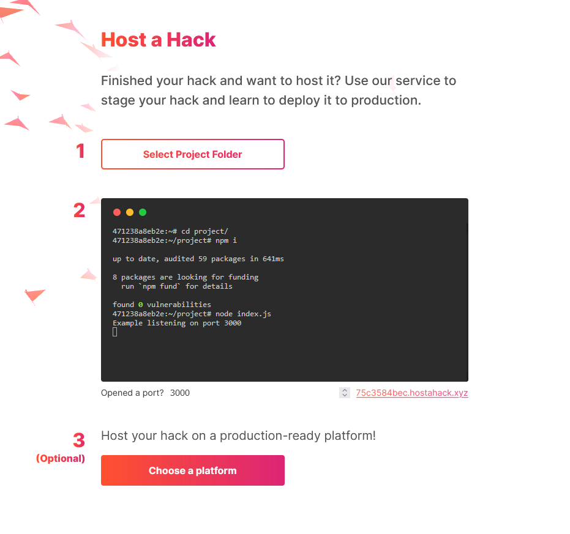

# Host a Hack

A Hassle free hosting solution for your hackathon projects! Try it at [https://hostahack.xyz](https://hostahack.xyz)

## Run locally

You will need [go](https://go.dev/), [docker](https://www.docker.com/) and [nginx](https://www.nginx.com/) installed.

```bash
# Clone the repo locally
git clone https://github.com/chebro/host-a-hack
cd host-a-hack

# Build the image
docker build -t hostahack:latest .

# Copy nginx config required to host on a domain. Make changes as required.
cp nginx.conf /etc/nginx/sites-enabled/hostahack.xyz

# Run the back-end server
go run .
```

## Website demo



## Inspiration

One of the most challenging tasks for a beginner participating in a hackathon is to figure out how to host their hackathon idea. Moving from `localhost:8080` to `mydomain.com` is not an easy task, figuring out how to work with virtual machines, finding a domain provider and understanding the nitty-gritty details of DNS management. It's all a huge hassle that takes up a significant amount of time that you can otherwise dedicate to developing your product.

So we decided to make it easy for out fellow hackers by creating an all in one platform that can do all of this for you.

Our motto is simple: if you can host it on `localhost`, let us take care of the rest.


## What it does?

Our platform provides:
- a shell for any user to jump right in.
- upload their projects and install the dependencies on our server, just like you would in your local machine.

Once everything is setup and the user hits the run command, we take care of the rest: 
- a private subdomain for your project is generated on the fly 
- any open port gets immediately picked up by our reverse proxy and you can see your project on the web!

Our platform also provides supporting guides for new users to familiarize themselves with hosting their projects on the top cloud platforms.

## How we built it

Our back-end was purely written in Golang as we wanted to explore a new language for this hackathon. We use docker containers to host the projects submitted by our users. And all the port forwarding heavy lifting is handled by trusty old Nginx.

Our idea was to make it extremely easy for a new user to jump in, so we create a fresh container for our users to hack away right as they visit our website. A project upload button dumps the project files directly into their freshly generated containers and users can quickly get up and running by getting their unique personal demo URL.

A container pool is maintained by the go program in the back-end to ensure minimum delay in acquiring a terminal for a new user.

The front end is a static HTML page, we decided to keep it simple and clean and put majority of our focus in grabbing the user's attention with our web terminal. Javascript was used in the front-end to send the files in a zip format to the back-end.

## Challenges we ran into

- The biggest challenge was to figure out a way to make the whole process instantaneous for our users, so we decided to allocate a container pool which is maintained by our server side go program that ensures that there are enough containers available at all times.
- We faced a huge hurdle while sketching up the solution for generating a web-link for each container, since our reverse proxy has to handle web-servers running on every container.
- Not having dedicated front-end engineers in our team made it difficult for us to make an even better and polished user experience.

## Accomplishments that we're proud of

- Within the small amount of time we were able to build an entire project in a fairly new language, and were able to host and run dynamic websites within minutes just as out motto promises.
- Even though we didn't have many front-end devs on our we team, we are proud of how our website ended up looking!

## What's next for Host a Hack

There's a lot of future scope for the project as our supported tech stacks is quite limited. We can definitely make progress in improving our website UI and UX department. We can also add additional guides for new comers to get used to our platform and how they can leverage it to host multiple projects.
